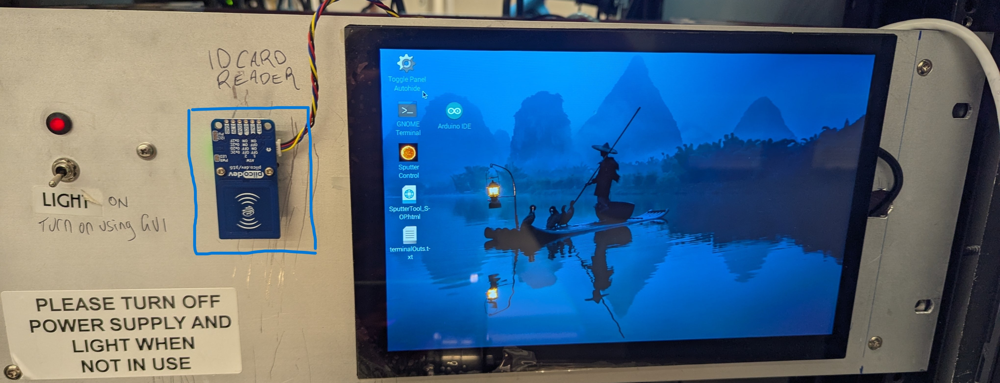
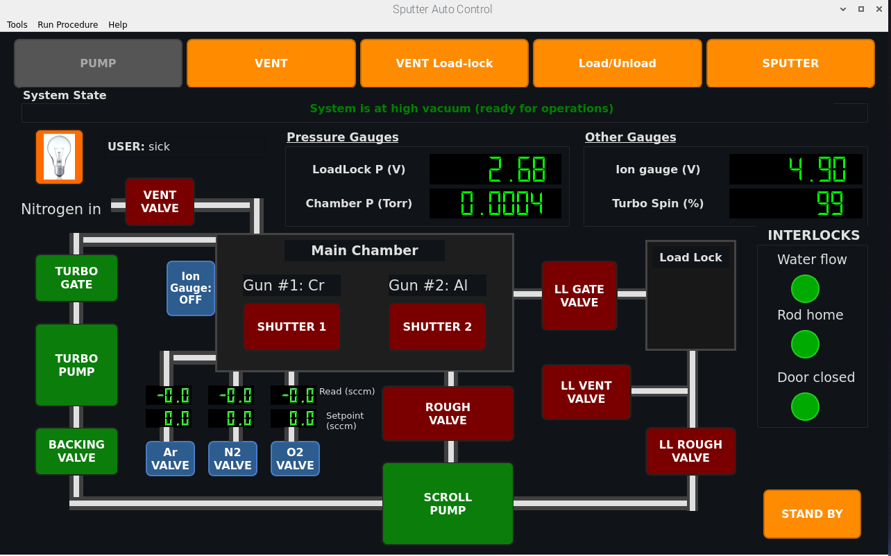
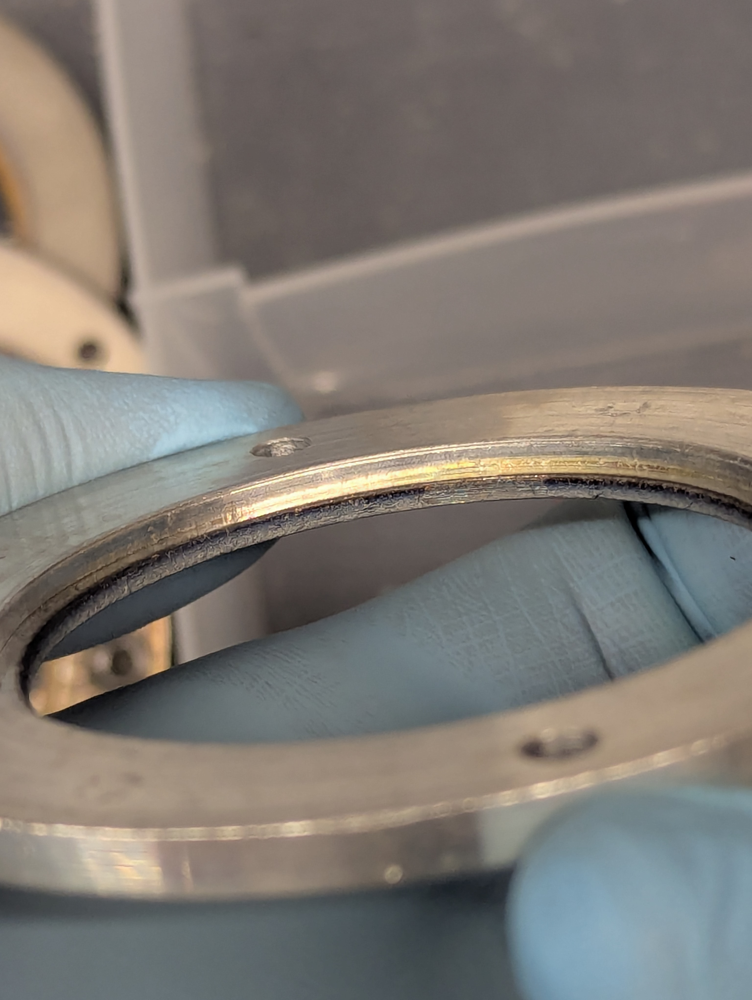
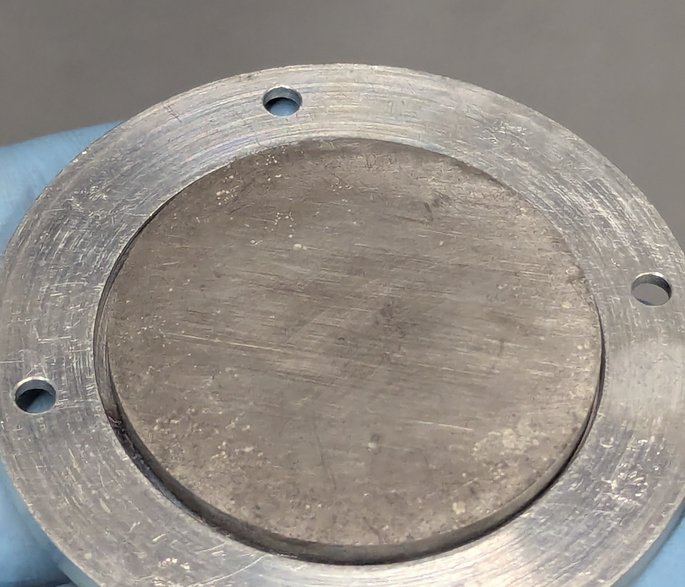
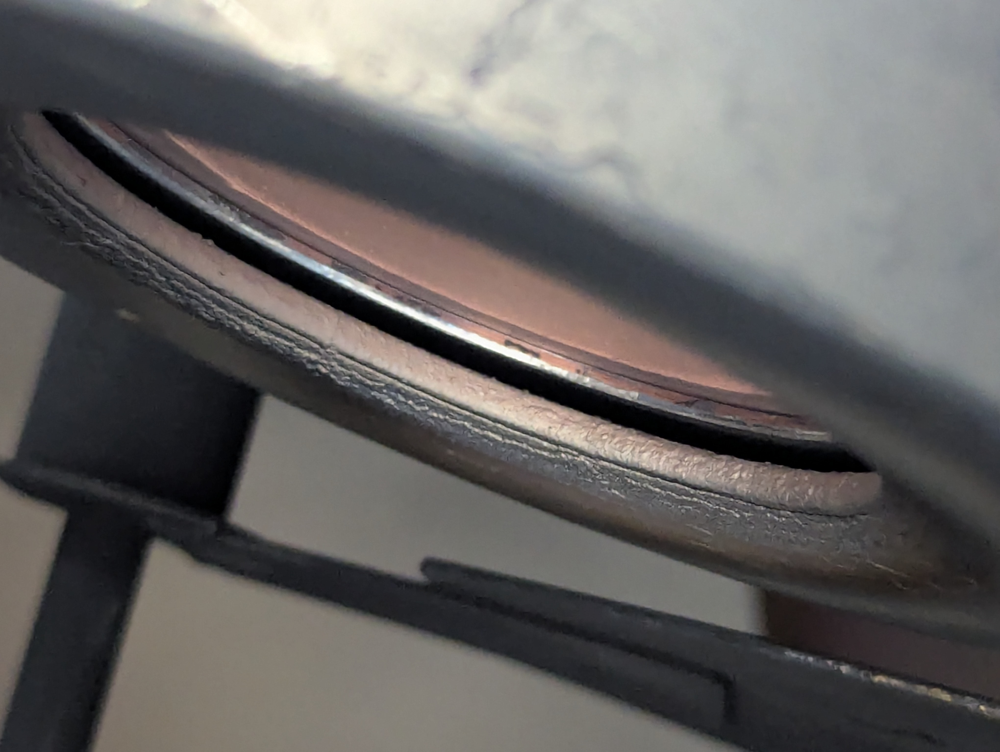
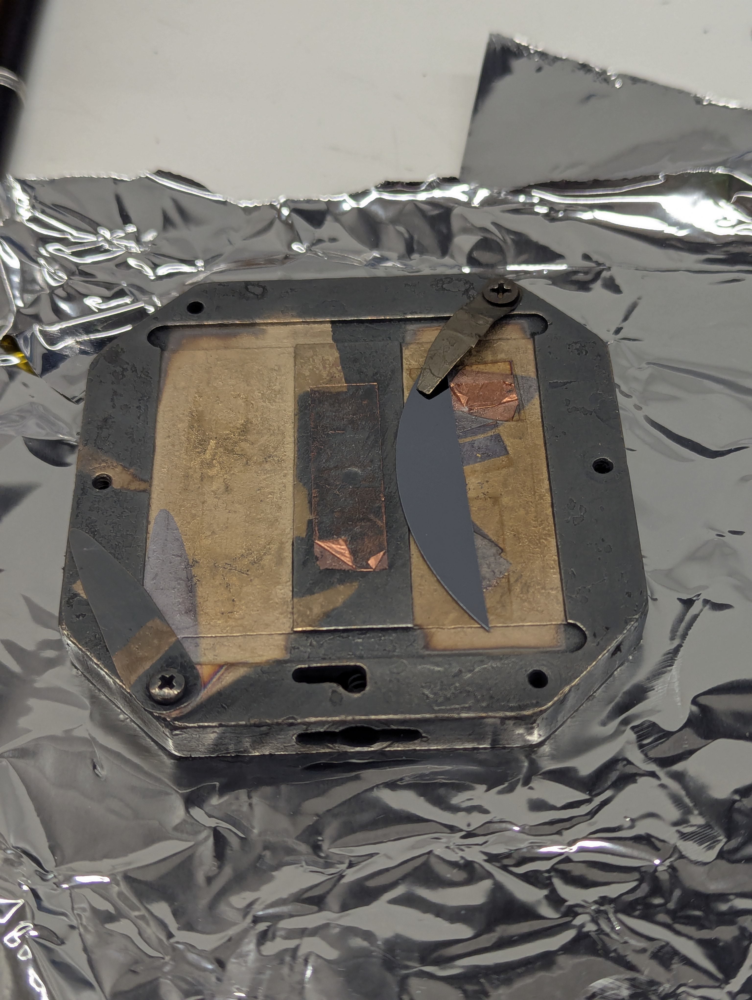
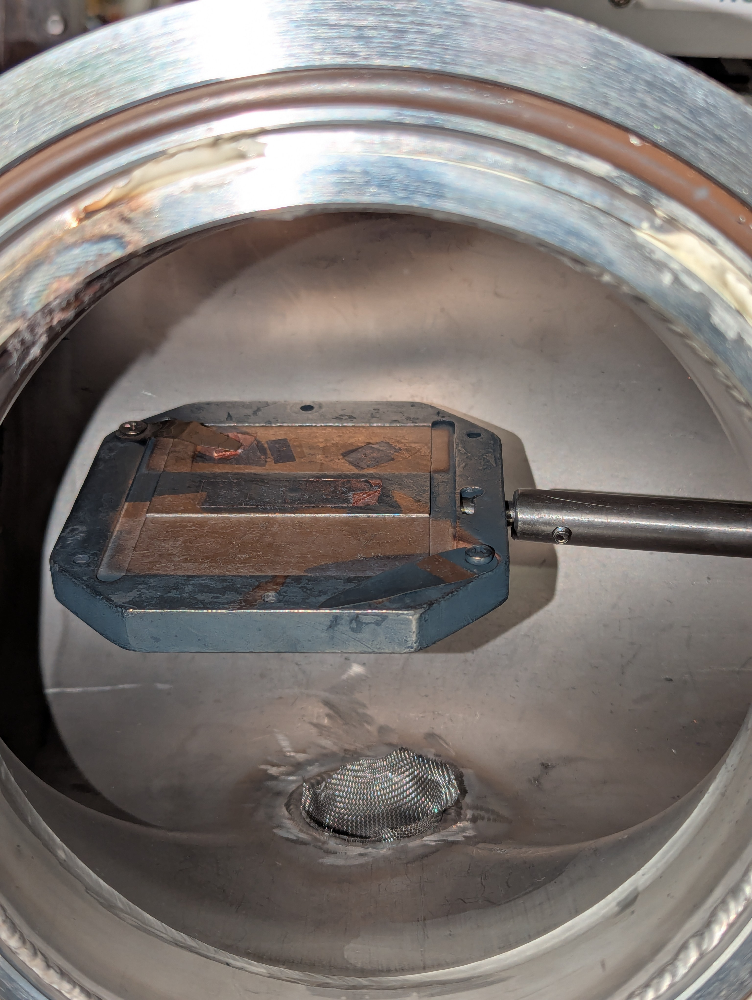
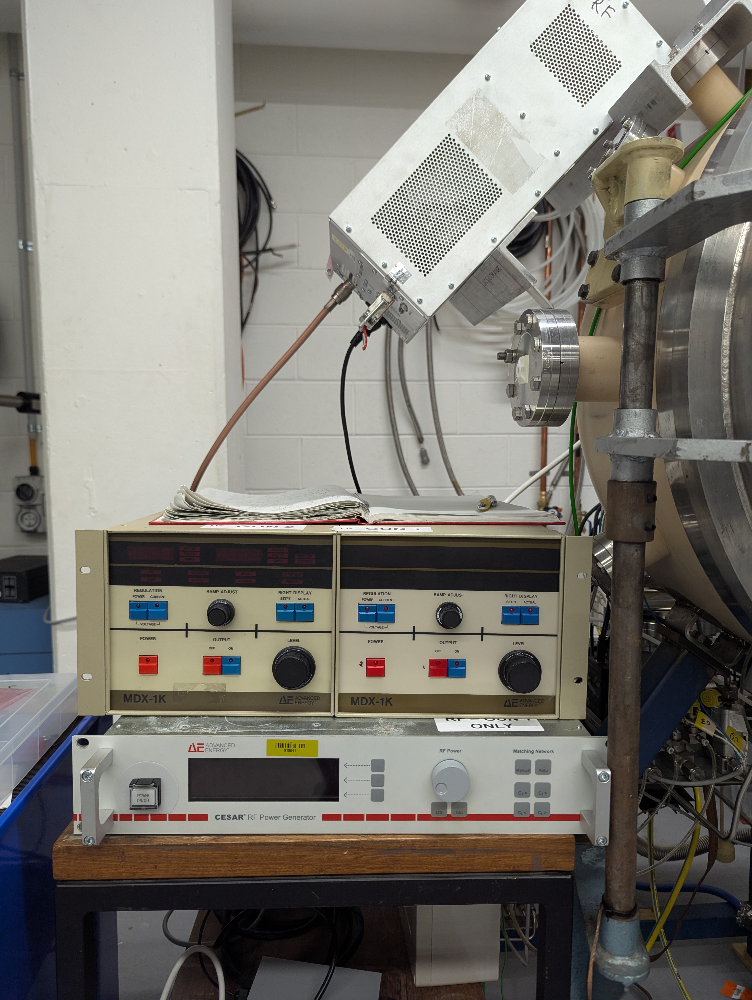
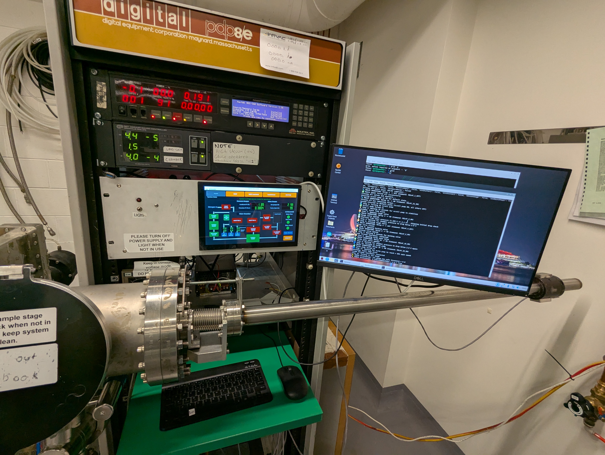

---
html:
  embed_local_images: true
  embed_svg: true
  offline: true
  toc: true
  
print_background: false
---

<style>
p {font-size: 14px}
li {font-size: 14px}
figcaption {font-size: 14px}
table {font-size: 13px}
math, .math {font-size: 14px}
code, pre {font-size: 13px}

```
/* Force continuous layout */
@media print {
@page {
  size: A4 portrait;
  margin: 0.05in 0.1in;
  height: auto}
}
```

</style>

# Magnetron Sputtering System - Standard Operating Procedure (SOP)

**Document Version:** 2.0  
**Last Updated:** October 20, 2025  
**Control System:** Python-Based Automated Control  
**Hardware Platform:** Arduino Mega 2560 R3

---

## Table of Contents

0. [System Overview](#system-overview)
1. [System Startup Procedure](#system-startup-procedure)
2. [Loading Samples and Targets](#loading-samples-and-targets)
3. [Deposition Procedure (DC Sputtering)](#deposition-procedure-dc-sputtering)
4. [System Shutdown](#system-shutdown)
5. [Load-Lock Operation](#load-lock-operation)
6. [Load-Lock Practice Procedure](#load-lock-practice-procedure)
7. [Safety Guidelines](#safety-guidelines)
8. [Troubleshooting](#troubleshooting)

---

## System Overview

The sputter system uses a custom software running on low-cost hardware. A raspberry Pi 5 runs the software (written in python) and interfaces via serial connection with an Arduino Mega running custom firmware (C++). The arduino operates relays that control valves, pressure gauges and vacuum pumps and other system components. User interface is a custom GUI via a touchscreen, bluetooth keyboard & mouse.

**NOTE:** The bluetooth keyboard requires about 4s to wake-up and reconnect after you press a button. It then stays awake. It will go back to sleep after 10 mins of no input.

<figure style="display:flex;gap:1px;align-items:flex-start">
   <div style="flex:1;margin:0">
      
      <figcaption style="text-align:center;font-size:13px;margin-top:6px">(a) "Cryopump" sputter system. It used to have a cryopump & we kept the name.</figcaption>
   </div>
</figure>

## 🚀 System Startup Procedure

### Prerequisites

- ✅ System power is ON
   - If system is in unpowered state turn on the power. There is a single power line that supplies the system on wall at right labelled "SPUTTER SYSTEM POWER".
   - The DC and RF power supplies for sputtering are powered separately as shown in the figure below. Turn this on too.

   <figure style="display:flex;gap:12px;align-items:flex-start">
      <div style="flex:1;margin:0">
         
         <figcaption style="text-align:center;font-size:13px;margin-top:6px">(a) Main power for system.</figcaption>
      </div>
      <div style="flex:1;margin:0">
         
         <figcaption style="text-align:center;font-size:13px;margin-top:6px">(b) This one supplies power to the DC & RF supplies. Here it is shown in the "on" position.</figcaption>
      </div>
   </figure>

- ✅ Raspberry Pi has booted to desktop.
   - When the power for the system is switched on, the RPi5 will auto-boot. Both screens should turn on.
   - If it does not boot, the RPi5 can be turned on by the power button on its case.
   - If the touch-screen is blank but the larger screen shows content after booting, unplugging & re-plugging the HDMI out from the RPi to the small screen should fix this.
- ✅ Arduino controller is connected via USB. This should be the case.
- ⚠️ If control program is already running, skip to step 3

### Launching the Control Application

***Note that the bluetooth keyboard will need a 5 seconds to wake up and connect after you push some buttons on it before input from it will show up on computer. It also needs to be charged occaisonally.***

1. **Start the Application**
   - Locate the **Sputter Control** desktop icon. It has a sun image icon :sunny:.
   - Double-click to launch the Python-based control application.
   - This will launch a terminal window that should be positioned on the large screen. This window shows running messages that details the system operation and is useful for debug.
   - A **user account login** window will show first prior to displaying the GUI.
   - **Login** with your user account if already have one. Simply hold your UTS ID card to the card reader. It should read your card, login your account & launch GUI.

   <figure style="display:flex;gap:1px;align-items:flex-start">
      <div style="flex:1;margin:0">
         
         <figcaption style="text-align:center;font-size:13px;margin-top:6px"> RFID card reader (blue square). Hold your UTS ID card to this to login or enrol card. </figcaption>
      </div>
   </figure>

   - Or create new account:
      - Click "Create Account".
      - Create username.
      - Create & confirm password.
      - Enrol your UTS ID card to go with account. Each account needs a unique ID card.
      - Account will login and GUI launch.
   - Main control window will then open. Drag this window onto the small screen (touch-screen) and double click the top title bar to expand the GUI window to fill the small screen.
   - You can use touch on the small screen to activate buttons on the GUI or keep using mouse.

2. **Check System State Display**
   - Observe the **System State** indicator in the control window
   - Current system status will be displayed (e.g., "Vented", "pumping", "High Vacuum")
   - All sensor readings (pressures, door status, water flow) should update automatically, these are connected to the interlock indicators (circles red/green in the INTERLOCKS box).
   - There are 3 interlocks that need to show True state (green indicator on GUI). These show the state of the water switch, rod home switch and the door switch. These are True when water flowing, load-lock rod is in home position & the chamber door is closed respectively.

3. **Verify Automated Procedure Buttons**
   - Five main auto-procedure buttons should be visible at top. They are enabled when orange, green while active and greyed out (inactive) when current state conditions disallows running of that procedure.
   - These buttons are the main way that the system is used.
   - Buttons are:
     - 🌊 **PUMP** - Start pump-down sequence.
     - 💨 **VENT** - Vent chamber to atmosphere.
     - 💨 **VENT Load-Lock** - Vent the load-lock chamber.
     - 📦 **LOAD/UNLOAD** - Load-lock operation, pumps load-lock & enables loading arm usage.
     - 🔬 **SPUTTER** - Enter sputtering mode.
     - 🏠 **STAND BY** - Return system to default state or standby state. This should be used at end of session to put system into low-power stand-by state.
   - **Whenever a procedure is active (button is green) you can cancel the procedure by pressing the button again.**

These automated procedure buttons (as well as the shutter buttons, Ion gauge & chamber light) are the only operable buttons when the GUI is running in "Normal" mode. Normal is the only mode accessible by a level 1 user account.

<figure style="display:flex;gap:1px;align-items:flex-start">
   <div style="flex:1;margin:0">
      
      <figcaption style="text-align:center;font-size:13px;margin-top:6px"> Main page of the PyQT based Graphical User Interface (GUI).</figcaption>
   </div>
</figure>

#### BOOT TROUBLESHOOTING

If the GUI displays with red indications for all three interlocks and the valve buttons display greyed out, it is likely that the arduino has failed to connect to RPi5.

**Verify Arduino Connection**

- Check USB cable between arduino & RPi5. Ensure that the arduino shows LED on indicator.
- Remove and replace USB cable to reset the connection.

---

## 📥 Loading Samples and Targets

- Vent chamber if necessary. This is done by pressing the "VENT" button on the GUI. Follow all directions that show in message windows such as ensuring that the door clamps are not closed prior to venting.
- Wait for the vent procedure to complete. Vent gas injection should stop automatically after the chamber door opens. Observe terminal output for procedure details.

### Starting from Vented Chamber State

#### Target Installation and Sample Loading

See [Video tutorial on target installation...](pics/vids/target_installation.mp4) for a video tutorial on target installation. See below for written instructions.

1. **Install Sputter Targets** (if not already in place)
   - Sputter targets must be 50 - 51 mm diameter. Typically targets are sold as either 50 mm (metric sizing) or 2 inch (50.8 mm, imperial sizing). Both fit fine.
   - Rings to hold targets and screws for both target ring and outer sheath electrode are kept in the box shown below (a). Keep tools clean and return to box after use.
   - Note that the target holder rings vary in depth of inset to accommodate targets of different thicknesses. See figure below (b).
   - Targets can be between 1 and 4 mm thick. Choose correct ring for your target thickness.
   - Rings also differ in internal diameter and some may not fit a 2 inch target. Choose correct ring for your target thickness and diameter.

   <figure style="display:flex;gap:12px;align-items:flex-start">
      <div style="flex:2;margin:0">
         
         <figcaption style="text-align:center;font-size:13px;margin-top:6px">(a) Box with clean tools & sputter system parts. The screws and rings you will need to use. Keep the tools clean and keep them in here.</figcaption>
      </div>
      <div style="flex:1;margin:0">
         
         <figcaption style="text-align:center;font-size:13px;margin-top:6px">(b) Ring to hold target. They have differing depths inset for different thicknesses of targets. This one is for a 2 mm tick target.</figcaption>
      </div>
   </figure>

   - Secure target with **4 Phillips head screws** labelled in box as "TARGET RING SCREWS".
   - Must use 4 screws and tighten firmly yet not too much to ensure good thermal contact.
   - Secure outer sheath electrode of gun with **3 circular head hex key screws**. Ensure that you use the 3 screws & tighten slightly with alum key.
   - Target installation is demonstrated during training.
   - Remember that heat removal by water cooling is essential and targets must be flat (on back surface) and have good contact with the copper gun plate.

   <figure style="display:flex;gap:12px;align-items:flex-start">
      <div style="flex:1;margin:0">
         
         <figcaption style="text-align:center;font-size:13px;margin-top:6px">(a) Backside of target inside holder ring. This target is 3mm & ring is for a 2mm target. Could be used but best to use ring with deeper inset. Ideally, target protrudes 0.1 - 0.4 mm. Note that it must protrude some so target is firmly held.   </figcaption>
      </div>
      <div style="flex:1.1;margin:0">
         
         <figcaption style="text-align:center;font-size:13px;margin-top:6px">(b) Fully assembled gun close-up showing gap between powered & grounded electrodes. If the electrodes touch gun is shorted. Must have a gap here. </figcaption>
      </div>
   </figure>

   - Once gun assembled with target: **test connectivity between target and outer sheath using multimeter**. You should see high resistance > 200 kOhm. If you see low resistance, target is shorted to grounded electrode and will not work. Re-check assembly.
   - If a ring with insufficient inset depth is used, shorting is likely.

   ##### **Gun 1 and 2 differences**:
      - Gun 1 is on left and Gun 2 is on right as you face the chamber front.
      - Gun 2 has a polished backing plate with inset. Gun #2 **can accomodate targets up to 4mm thick**.
      - *Gun 1 has a flat backing plate and can only accomodate targets up to 3mm thick.*
      - Use gun #2 only for your thick target.

   - Note that you could now load your sample stage onto the central spindle now rather than using load-lock as described below.

#### Door Closure and Clamp Procedure

⚠️ **CRITICAL:** Proper door sealing is essential for vacuum integrity

2. **Close and Seal Chamber Door**
   - Close door carefully, ensuring O-ring is clean and properly seated
   - Tighten **both door clamps**:
   - The clamps are simple nuts on bolts. **a T-key with hex socket tool** for the task is hanging nearby from a ribbon.
   - **Both clamps should be tightened to close the gap between sealing surface and door o-ring** before starting pump-down. They don't need to be tightened excessively.

3. **Initiate Pump-Down**

   - Click/press the **PUMP** button
   - Monitor pressure readings on display and/or the Vacuum gauge controller.
   - If chamber pressure does **not** drop within 5s or so when pump-down starts:
     - **Chamber is leaking!**
     - Tighten further the upper and/or lower clamps to improve door seal.
     - If the chamber pressure does not start dropping within 30s the software will abort the pumpdown procedure in order to protect the pump.
   - Wait for pump procedure to complete, observe terminal output for details of what is occurring at each step of the pump-dowb procedure. Pump-down should take system all the way to the high vacuum state before completing.
   - If Ion guage turns itself off, you can turn it on/off at will by pressing the button.

---

### Starting from Pumped Chamber State

If the chamber is already under vacuum, use the **Load-Lock** system to introduce samples without venting the main chamber.

#### Load-Lock Sample Loading Procedure

1. **Vent Load-lock**
   - Click **VENT Load-lock** button
   - System will automatically:
     - Vent load-lock chamber
     - Wait for load-lock to reach atmospheric pressure.
     - Venting will stop automatically.

   <figure style="display:flex;gap:12px;align-items:flex-start">
      <div style="flex:1;margin:0">
         
         <figcaption style="text-align:center;font-size:13px;margin-top:6px">(a) Sample stage of sputter system. Use clips or use vacuum compatible double-sided tape to mount sample/s. </figcaption>
      </div>
      <div style="flex:1;margin:0">
         
         <figcaption style="text-align:center;font-size:13px;margin-top:6px">(b) Sample stage on load-lock arm. Close door, pump & load stage using "Load/Unload". </figcaption>
      </div>
   </figure>

2. **Load Sample and Sample Stage**
   - Place sample on sample stage holder (take holder out and do sample prep on clean foil surfaces).
   - Verify samples are secure. Vacuum compatible double-sided copper tape or SEM mount adhesive should be used. Don't use non-vacuum compatible tape.

3. **Load Sample onto Load-Lock Rod**
   - Open small load-lock door
   - Attach sample stage to load-lock rod bayonet fitting as shown in (b) above.
   - Close load-lock door

4. **Load/Unload Procedure**
   - Click **LOAD/UNLOAD** button
   - System will automatically:
     - Evacuate load-lock chamber.
     - Open gate valve between load-lock and main chamber once the pressure in both chambers is similar.
     - A dialog box will appear and remain in place during your operation of the load-lock rod.
     - Move the load-lock rod into the main chamber and get the sample stage onto the central shaft.
     - Retract the load-lock rod to home position.
  ⚠️ **CRITICAL:** Rod must be fully retracted to home position before continuing.
     - Click **Load-unload finished or cancel** button in the dialog box when complete.
     - This will close the gate valve automatically and complete the load-lock sequence.
     - Click "PUMP" button again to return system to high vacuum state in order to proceed to sputter mode.

**Note:** Do not close program whilst the load-lock rod is extended into chamber. *System will close gate valve automatically when the GUI is rebooted and this will close on the load-lock rod causing damage*.

#### Load-Lock Z-Position Adjustment & Chamber Illumination

   <figure style="display:flex;gap:08px;align-items:flex-start">
      <div style="flex:1;margin:0">
         
         <figcaption style="text-align:center;font-size:13px;margin-top:4px">(a) Load-lock Z-position adjustment nuts. Hold rod up/down to release pressure on nuts, then adjust nuts to change rod height. Adjusting these during loading/unloading is necessary.</figcaption>
      </div>
      <div style="flex:1;margin:0">
         
         <figcaption style="text-align:center;font-size:13px;margin-top:6px">(b) Chamber light has a switch and is also operated by the GUI. Switch shown at right in "on" position (LED lighted red). Both switch and button must be on for light to operate. Stage rotation power supply shown at bottom right.</figcaption>
      </div>
   </figure>

- Use Z-position adjustment nuts on load-lock rod to set proper height for sample stage during loading/unloading.
- Chamber light should turn on automatically during load-lock operation. If not, manually turn it on using the button on the GUI.
- ⚠️ **Turn off after use** - do not leave light on during sputtering.

#### Sample Stage Rotation (Optional)

If uniform coating is desired, enable stage rotation:

- Turn on the **DC variable power supply** that is connected to the stage rotation motor.
- This is located on the shelf underneath the touchscreen, shown above in right image.
- Use constant voltage mode
- Adjust voltage knob: **0-6V** to set rotation speed
- **Recommended during deposition:** 4V
- **Absolute maximum:** 12V
- ⚠️ **Turn off power supply when rotation not in use** This component is not linked to the software in any way and must be manually controlled.

---

## 🔬 Deposition Procedure (DC Sputtering)

### Starting from High Vacuum State

- Pump system to high vacuum state if not already there by pressing **PUMP** button.
- Wait for pump procedure to complete and system to reach high vacuum.
- It is recomended to reach at least < 6 x 10⁻5 Torr before proceeding to sputtering.
- System base pressure appears to be around 1.5 x 10⁻5 Torr at the moment.

### SPUTTER MODE

0. **Enter Sputter Mode**
   - Click **SPUTTER** button on main control window
   - System will enter sputtering mode
   - ***This will turn on the interlock that provides mains power to the DC & RF supplies that power the sputter guns.***
   - The power supplies cannot be turned on outside of sputter mode due to the safety interlock.
   - System state display will update to "Sputter Mode"
   - ***Sputter mode will drop the TMP speed to 60% and maintain it at this level by turning it on and off as needed.***
  
1. **Set Gas Flow**
   - Gas flow setpoint is set by simply clicking the gas flow setpoint indicator button for the MFC/s that you wish to use. See the figure below.
   - Click inside one of the colored boxes shown below to bring up the set gas flow setpoint dialog. Set the setpoint using the dialog.
   - Allow 5s or so for the indicators on the GUI to update to display the correct setpoint and flow readings.
   - If setpoint shows yet the measured flow never reaches setpoint, the gas cylinder for that gas may be empty.

   <figure style="display:flex;gap:12px;align-items:flex-start">
      <div style="flex:1;margin:0">
         
         <figcaption style="text-align:center;font-size:13px;margin-top:6px">(a) Click inside the colored box to bring up the set gas flow setpoint dialog.</figcaption>
      </div>

2. **Chamber Flush** (Optional but Recommended)
   - Set Argon flow to **100-200 sccm** for 1 - 10 minutes
   - This helps remove remaining residual air and water vapor from chamber.
   - Monitor chamber pressure during flush.

3. **Set Sputtering Gas Flow**
   - Reduce Argon flow to sputtering conditions
   - **Typical DC metal sputtering:** 20-100 sccm Ar
   - **Target chamber pressure:** 1-7 × 10⁻³ mbar
   - Wait for pressure to stabilize, (does not need long).

### DC Sputtering Operation

1. **Verify Electrical Connections**
Ensure that:
   - ✅ Electrical cable between gun and DC power supply is connected
   - ✅ Grounding cables are properly connected
   - ✅ All connections are secure
   - It is best to also check with a multimeter when you load your target. Measuring between your target surface and the outer sheath (grounded) of the magnetron gun, you should see high resistance > 200 kOhm. Connectivity indicates short. One can also measure this by measuring resistance between inner pin and outer casing of the electrical connector that connects to the DC power supply.

2. **Begin stage rotation (optional)**
   - Turn on small DC supply above keyboard connected to the stage rotation motor.
   - Use constant voltage mode and apply 1 - 12 V to set spin speed.
   - Do not exceed 12V.

3. **Power Supply Setup**
   - Turn on **DC power supply** for the gun(s) being used. First switch the breaker at back of unit and then the power button on front at bottom left.
   - Set setpoint using the "Right display - SETPT" button and dial.
   - Ensure that setpoint is set as power (watts) and that right display "ACTUAL" is set to show watts.
   - Set **power setpoint**:
     - **Typical range:** 30-100 W
     - **Absolute maximum:** 300 W

   <figure style="display:flex;gap:08px;align-items:flex-start">
      <div style="flex:1;margin:0">
         
         <figcaption style="text-align:center;font-size:13px;margin-top:4px">(a) Power supplies DC & RF.</figcaption>
      </div>
      <div style="flex:1.24;margin:0">
         
         <figcaption style="text-align:center;font-size:13px;margin-top:6px">(b) System electrical hardware. The power supply for stage rotation is seen behind the load-lock.</figcaption>
      </div>
   </figure>

4. **Start Deposition Monitor**
      - Launch **MaxTec deposition monitor**.
      - Choose process with your target material
      - See [MaxTec Operation Manual](MaxTec_FilmMonitor.pdf) for further information.

5. **Ignite Plasma**
   - Press **OUTPUT "ON"** on power supply to apply power.
   - You should see the "ACTUAL" power (watts) displayed on RIGHT DISPLAY ramp up to meet your setpoint.
   - Plasma should ignite on gun - you will see characteristic glow behind shutter.
   - Close **front window shutter** with the magnet slide to prevent window coating.
   - Run plasma for some period with shutter closed in order to pre-sputter/clean your target. This varies for every material.
   - When ready to start deposition:
      - Begin reading on the Maxtec thickness monitor.
      - Open shutter to begin deposition on your sample.
   - Verify deposition monitor shows:
     - Non-zero deposition rate
     - Increasing thickness reading
     - Adjust power if necessary.
     - Remember that the tooling factor is critical for showing accurate deposition rate reading.

6. **Begin Sample Deposition**
   - Open **gun shutter** to start deposition on sample
   - ⏱️ **Restart MaxTec monitor** simultaneously for accurate thickness reading
   - Monitor deposition rate and thickness

7. **Run to Desired Thickness**
   - Continue sputtering until target thickness achieved
   - Typical rates vary by material and power (refer to training or previous logs)

---

## 🛑 System Shutdown

### Post-Deposition Procedure

1. **Terminate Sputtering**
   - Turn off **DC power supply/s**
   - Turn off **breaker switch** at back of power supply
   - Allow plasma to extinguish completely

2. **Exit Sputter mode & Stop Gas Flow**
   - Click again the currently green "SPUTTER" button in order to cancel Sputter mode.
   - Wait for cancelling to complete.
   - This will automatically close gas valves and set MFC flows back to 0.
   - Once complete, either go to "STAND-BY" or "VENT" or "PUMP".

3. **Remove Sample via Load-Lock**
   - Click **LOAD/UNLOAD** button
   - Follow load-lock procedure in reverse:
     - System vents load-lock
     - Open small door when dialog appears
     - Use rod to retrieve sample stage from chamber
     - Remove sample from stage
     - **Leave sample stage inside load-lock for next user**
     - Close load-lock door
     - Click Continue

4. **Re-Evacuate Load-Lock**
   - Click **LOAD/UNLOAD** again to evacuate load-lock
   - System will pump down load-lock automatically

5. **Return System to High Vacuum**
   - Click **PUMP** button to return system to stable high vacuum state
   - Final system state should show:
     - ✅ Roughing pump ON (green)
     - ✅ Rough valve OPEN (green)
     - ✅ Turbo pump ON & ~100% speed (green)
     - ✅ Gate valve CLOSED (red - correct)
     - ✅ All other valves CLOSED (red - correct)
     - ✅ Ion gauge ON (green - if high vacuum achieved)

6. **Alternatively: vent system & remove targets**
   - I would not recommend leaving targets in system for too long.
   - If you don't intend to use system again real soon, then remove target/s.

### Final Checks

6. **Verify Equipment Status**
   - ❌ All DC/RF sputter supplies are **OFF**
   - ❌ DC supply for stage rotation is **OFF**
   - ❌ Chamber light is **OFF**

7. **Update Target Labels**
   - If targets were changed, update **sticky note labels** on chamber door
   - Write material name and installation date.

8. **Complete Instrument Logbook entry**
   - The GUI has a digital logbook. The window is opened when the GUI is booted.
   - It can be re-opened through: Tools -> Logbook
   - Enter the Target material for each gun and write notes about session. Then click "Add Entry".
   - The GUI will display the last entry for the Gun target materials.

## At END of Session

**Leave System in Standby state with GUI closed.**
   - CLick "STAND-BY" button on GUI at bottom right.
   - Wait for procedure to complete taking system to default state (all components off except scroll).
   - "Click "Yes" on the dialog box that pops up asking if you want to go to Stand by.
   - Stand-by mode has all vacuum components off and valves closed.
   - **Close the GUI** and associated terminal to logout your user account.
   - Leave system like this unless next user requests to leave pumping. Next user will open GUI and login anew.

---
# Other Information

## 🔄 Load-Lock Operation

### Load-Lock Rod Control

The load-lock rod extends into the main chamber through a gate valve to position samples.

**Key Components:**
- **Bayonet fitting** - Quick-connect mount for sample stage
- **Z-position adjustment nuts** - Control vertical position of rod end
- **Gate valve** - Separates load-lock from main chamber

### Load-Lock Procedure Summary

**Loading Sample:**
1. VENT LOAD-LOCK  → load lock vents & venting stops once complete → open small door
2. Attach samples to stage → attach stage to rod → close door
3. Click "LOAD/UNLOAD".
4. System pumps load-lock → opens gate valve automatically when complete
5. Adjust Z-nuts → position stage in chamber → detach rod → retract rod → Continue

NOTE: Load-lock arm must be in home position before LOAD/UNLOAD dialog can be exited.

**Removing Sample:**
1. Similar procedure to above yet in reverse.

---

NOTE: There is a "MANUAL" mode that can be accessed on this GUI by a User account of level > 1. This enables practice with the load-lock arm in atmosphere as described below. Ask System Administrator for details.

## 🎓 Load-Lock Practice Procedure

⚠️ **Important:** The load-lock sample loading procedure can be difficult to master initially. The sample stage can fall off the load-lock arm during loading if not done well. This necessitates venting main chamber.
To avoid this eventuality, **Practice with the chamber vented and door open** until confident you can operate it when your view is restricted to the small windows with door closed, at vacuum.

**If sample stage is dropped inside chamber during attempted load-lock use, the chamber must be vented to retrieve it!**

### Setup for Practice

1. **Prepare System for Practice**
   - Use automated procedures:
     - Click **VENT** to vent main chamber (if not already vented)
     - Click **LOAD/UNLOAD** to vent load-lock
     - Wait for both to reach atmospheric pressure
   - Ensure load-lock rod is in **home position** (fully retracted)

2. **Open Chambers**
   - Open main chamber door
   - Open small load-lock door
   - Verify rod is retracted

### Manual Gate Valve Control for Practice

3. **Access Manual Control Mode**
   - User accounts with level 2 and above access will see the "Mode" button at bottom right above the "Stand-By" button.
   - Use this to enter "Manual" mode using the password provided to you by system administrator.
   - *If passwords are lost, contact James Bishop via the Github repo or jamesdbishop1@gmail.com.*
   - Once in manual control you can activate vacuum components by pressing the associated button if the safety conditions are met. A dialog will show if conditions not met.
   - The safety conditions should prevent system damage.

4. **Open load-lock Gate-Valve**
   - Vent load-lock. Both main chamber & load-lock must be at atmosphere.
   - Open load-lock gate by pressing button.

### Practice Loading

5. **Practice Sample Stage Loading**
   - With main door **open** and gate valve **open**, practice:
     - Extending rod into chamber
     - Adjusting **Z-position nuts** to align stage with central shaft
     - Rotating stage onto shaft (bayonet fitting)
     - Adjusting nuts again to relieve pressure on fitting
     - Rotating rod 90° to release from stage
     - Retracting rod without pulling stage off shaft

6. **Practice Unloading**
   - Reverse the sequence:
     - Adjust Z-nuts for proper height
     - Engage bayonet fitting with stage
     - Rotate to lock
     - Retract rod with stage attached
     - Return to home position

### Cleanup After Practice

7. **Go to stand-by mode and return to "Normal mode"**
   - When stage is loaded and rod is at home position
   - **Close gate valve** (rod MUST be home!)
   - Press Stand-By" button.
   - Use mode diualog to select Normal mode yet again.

---

## ⚠️ Safety Guidelines

### General Safety

- 🚫 **Never open main chamber door while system is under vacuum**
- 🚫 **Never force any valve or mechanical component**
- 🚫 **Do not operate system without proper training**
- ⚠️ **Always wear appropriate PPE** (safety glasses, gloves when handling samples)
- ⚠️ **High voltage present** when DC/RF supplies are active
- ⚠️ **Hot surfaces** - allow targets and chamber to cool before handling

### Pressure Safety

- ✅ Always verify chamber is **vented** before opening door
- ✅ Monitor pressure readings during all operations
- ⚠️ Sudden pressure loss may indicate leak or valve malfunction
- ⚠️ Inability to reach high vacuum may indicate O-ring or seal issue

### Electrical Safety

- 🔌 Verify all electrical connections before applying power
- ⚠️ **DC supplies can deliver high currents** - ensure proper grounding
- ⚠️ RF supplies generate high frequency radiation - keep clear
- 🚫 Do not modify electrical connections without supervision

### Gas Safety

- 💨 Process gases (Ar, O₂, etc.) displace oxygen - ensure adequate ventilation
- ✅ Verify gas flow rates before starting deposition
- ⚠️ High gas flows can cause rapid pressure rise
- 🚫 Never exceed recommended maximum gas flow rates (200 sccm Ar max for flush)

### Mechanical Safety

- ⚠️ Load-lock rod can be pinched in gate valve - always verify home position
- ⚠️ Stage rotation motor has exposed moving parts - keep clear
- ⚠️ Door clamps must be properly tightened before pump-down
- 🚫 Do not operate load-lock if rod binding or sticking

---

## 🔧 Troubleshooting

### Common Issues and Solutions

#### Chamber Won't Pump Down

**Symptoms:** Pressure remains high after PUMP procedure starts

**Possible Causes:**
- Door clamps not tightened enough to close gap between o-ring & door.
- O-ring dirty or damaged
- Valve stuck open
- Rough pump failure

**Solutions:**
1. Check door clamps - tighten if needed
2. Vent chamber and inspect O-ring
3. Verify all valves show correct state in control program
4. Check rough pump power and operation
5. Contact staff if problem persists

#### Gate Valve Won't Open

**Symptoms:** Load-lock procedure fails, gate valve remains closed

**Possible Causes:**
- Pressure difference too high between chambers
- Valve actuator failure
- Safety interlock preventing operation

**Solutions:**
1. Verify load-lock has fully evacuated (check pressure reading)
2. Wait longer for pressure equalization
3. Check safety status in control program
4. Restart load-lock procedure
5. Contact staff if valve remains stuck

#### Plasma Won't Ignite

**Symptoms:** No plasma glow when DC power applied

**Possible Causes:**
- Chamber pressure too low or too high
- Target not properly grounded
- Power supply malfunction
- Gas flow not established

**Solutions:**
1. Verify chamber pressure is in range (1-3 × 10⁻³ mbar)
2. Check gas flow is active (20-50 sccm Ar)
3. Verify target and electrode connections
4. Check DC power supply settings and operation
5. Try increasing pressure slightly (more gas flow)
6. Contact staff if plasma still won't ignite

#### Sample Stage Dropped in Chamber

**Symptoms:** Stage fell off shaft during load-lock operation

**Impact:** ⚠️ **Chamber must be vented to retrieve stage**

**Solutions:**
1. Click **VENT** button to vent chamber safely
2. Open main chamber door when fully vented
3. Retrieve sample stage carefully
4. Inspect stage and bayonet fitting for damage
5. Practice load-lock operation with door open before retrying
6. Inform staff of incident

#### Control Program Unresponsive

**Symptoms:** Buttons greyed out, error messages on terminal.

**Possible Causes:**
- Arduino connection lost
- Application frozen

**Solutions:**
1. **Close and restart application.** This can be done at any time if a software error is encountered.
2. Reboot the raspberry Pi if problem persists
3. Contact staff for assistance

#### Memory/Performance Issues (Plotter Window)

**Symptoms:** Application slow, high memory usage, plotter window lag

**Solutions:**
1. Close plotter window if not needed
2. Restart application if memory usage high
3. Ensure psutil is installed for memory monitoring
4. Memory monitoring will auto-reset at 80% threshold
5. Check system RAM if issues persist

---

## 📋 Pre-Use Checklist

Before each deposition session, verify:

- [ ] Received proper training on system operation
- [ ] Reviewed this SOP document
- [ ] System power is ON and stable
- [ ] Control application connects successfully

---

## 📞 Emergency Contacts

Software author:
- James Bishop
   - jamesdbishop1gmail.com
   - https://github.com/HelloThereMatey

**For system malfunctions or emergencies:**
- Contact supervising staff immediately
- Do not attempt repairs without authorization
- Document issue in instrument logbook

**After-hours emergencies:**
- Follow facility emergency procedures
- Contact facility management

---

## 📝 Revision History

| Version | Date | Author | Changes |
|---------|------|--------|---------|
| 1.0 | (Original) | - | Original LabVIEW-based SOP |
| 2.0 | October 2025 | System Team | Updated for Python-based control system, added detailed procedures, icons, and formatting |

---

**End of Standard Operating Procedure**

*This document should be reviewed and updated annually or when significant system changes occur.*
