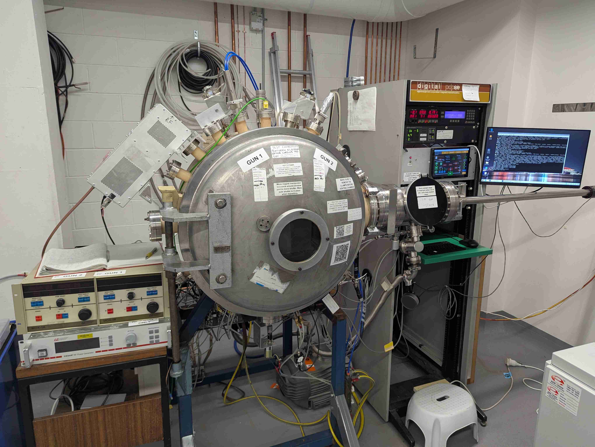
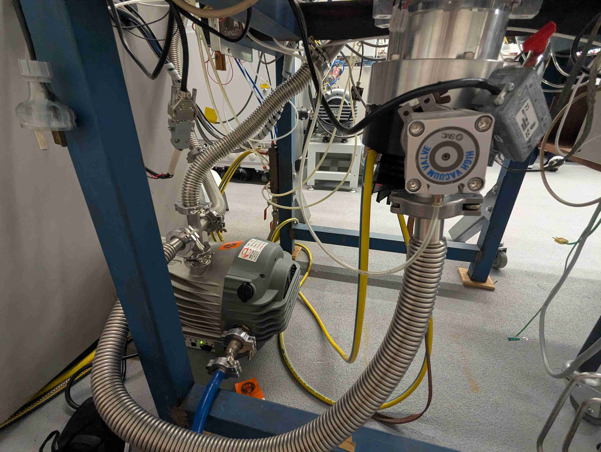
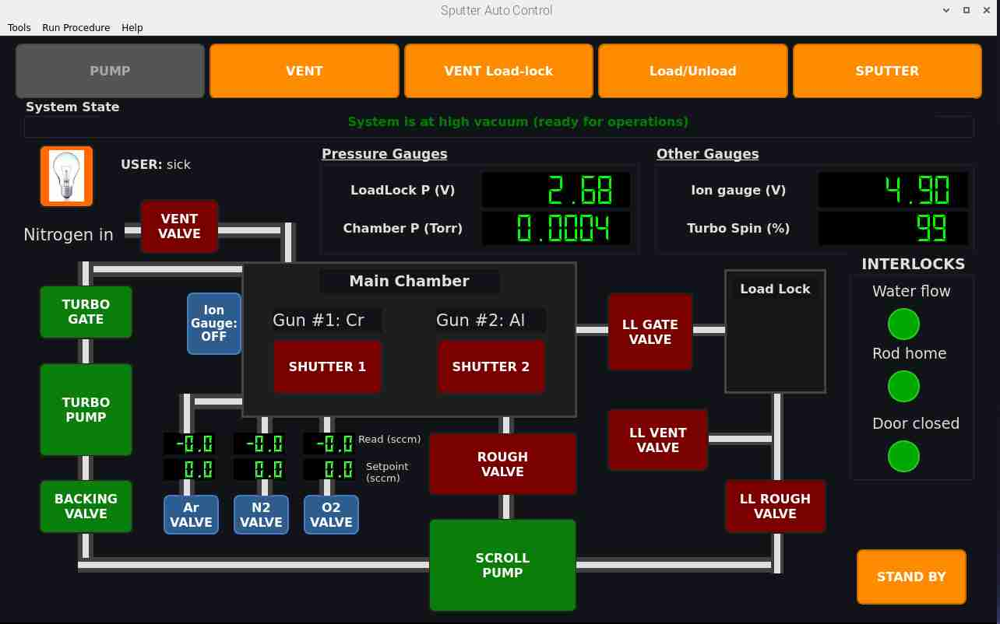

---
html:
  embed_local_images: true
  embed_svg: true
  offline: true
  toc: true
  
print_background: false
---

<style>
p {font-size: 14px}
li {font-size: 14px}
figcaption {font-size: 14px}
table {font-size: 13px}
math, .math {font-size: 14px}
code, pre {font-size: 13px}

```
/* Force continuous layout */
@media print {
@page {
  size: A4 portrait;
  margin: 0.05in 0.1in;
  height: auto}
}
```

</style>

# Magnetron Sputter Thin Film Deposition System - Project Summary

**Date:** October 2025

## Hardware Architecture

The magnetron sputtering system was built from component parts assembled in-house, combining commercial vacuum equipment with custom electronic controls. Many parts are old, some new. Thin-film deposition results with the system are as good as our new commercial tools. System built over 2015 - 2020 by Geoff Mcredie at UTS. Later Rebuilt by James Bishop over 2023 - 2025.

Recent updates involved rebuilding the sputter guns and the vacuum system, replacing pumps and gate valves. New safety system implemented to prevent sputter gun power supplies being energized when this could present a hazard. New safety system also prevents damage to system components & reduces wear on pumps. User authentication system added to restrict and monitor system usage.

#### Control Software Upgrade

The old LABVIEW based control software was replaced with a new open-source control stack utilizing Raspberry Pi 5 (RPi5), Arduino and Python and C++. A GUI was built using PyQt with python based backend. The RPi5 interfaces with the Arduino Mega via serial communication. The arduino runs on C++ firmware. A new touch-screen display and large display were installed as seen below. Custom circuits were built for signal scaling and conditioning.

The software controls all system components, interfacing with power supplies, vacuum gauge controllers and thin-film deposition monitor. Safety interlock switches are used to detect state of hardware such as water flow, chamber door state and load-lock rod, power supply energy etc. and are used by the system safety module to prevent hazards. Valves and pumps are operated via relays and pneumatic solenoid switches.

A user interfaces with system via GUI which can be operated via touch. RFID card reader is used for User Account Control to restrict usage to authorized lab users at UTS and for logging to monitor system usage.



### Vacuum System

The vacuum system consists of three primary pump stages enabling evacuation from atmospheric pressure to high vacuum:

- **Scroll Pump**: Rough vacuum stage.
- **Turbomolecular Pump (TMP)**: High vacuum stage.
- **Pressure Gauges**:
  - Pirani gauge (load-lock roughing stage)
  - Pirani gauge (chamber roughing stage)
  - Ion gauge (high vacuum chamber pressure)
  - Turbo spin speed monitoring

- **Vacuum Valves**: Pneumatic valves operated using compressed air solenoid switches. Controlled via relays to switch compressed air-flow. 14 valves total.

   <figure style="display:flex;gap:4px;align-items:flex-start">
      <div style="flex:1;margin:0">
         
         <figcaption style="text-align:center;font-size:13px;margin-top:6px">(a) Vacuum pumps: scroll pre-vacuum pump (PVP) & turbomolecular pump (TMP).</figcaption>
      </div>
      <div style="flex:1;margin:0">
         
         <figcaption style="text-align:center;font-size:13px;margin-top:6px">(b) DC & RF power supplies to drive sputter deposition.</figcaption>
      </div>
   </figure>

### Chamber Architecture

- **Main Chamber**: High-vacuum deposition environment with water-cooled magnetron guns
- **Load-Lock Chamber**: Isolated secondary chamber for sample transfer without venting main chamber

### Magnetron Sputtering Guns

- 2 x DC/RF magnetron sources with water-cooled target mounts and solenoid shutters.

### Power supplies

These drive the sputter process for thin-film deposition.

- 2 x 600 W Advanced Energy pulsed DC supplies.
- 1 x 500 W Advanced Energy 13.56 MHz RF supply.

### Process Gas System

- Alicat APEX mass flow controllers (0-200 sccm per channel) for Argon, Nitrogen, and Oxygen delivery with automated valve control

### Electronic Control Hardware

- **Raspberry Pi 5**: Python/PyQt5 GUI, automated procedures, user authentication, data logging
- **Arduino Mega 2560 R3**: controls system hardware via 23 relay outputs, 4 digital inputs (interlocks), 4 analog inputs (pressure/speed), 9600 baud serial
- **Displays**: 7-inch touch screen (primary) and large monitor with keyboard/mouse
- **Pressure Gauge Controllers**: Multi-channel analog readout for Pirani and ion gauges
- **Deposition Monitor**: Quartz crystal microbalance (QCM) thickness/rate monitor.
- **RFID Reader**: Raspberry Pi Pico with I2C RFID module for card-based user authentication

### System Integration

All hardware subsystems communicate through the Raspberry Pi 5, which acts as the central control hub:

```
Raspberry Pi 5 (Supervisory Control)
├─ Arduino Mega (Serial 9600 baud)
│  ├─ 23 Digital Outputs
│  ├─ 4 Digital Inputs
│  └─ 4 Analog Inputs
├─ Pressure Gauge Controllers (Serial)
├─ Alicat MFC Controllers (Serial)
├─ Deposition Monitor (Serial)
├─ Power Supplies (Digital and analog I/O)
├─ RFID Reader (USB Serial)
│  ├─ Raspberry Pi Pico (Custom Firmware)
├─ Touch-Screen Display (HDMI + USB)
└─ Large Monitor Display (HDMI + USB)
```

   <figure style="display:flex;gap:4px;align-items:flex-start">
      <div style="flex:2;margin:0">
         
         <figcaption style="text-align:center;font-size:13px;margin-top:6px">(a) Electronics hardware.</figcaption>
      </div>
      <div style="flex:2.7;margin:0">
         
         <figcaption style="text-align:center;font-size:13px;margin-top:6px">(b) Internals of electronic control box.</figcaption>
      </div>
   </figure>


### Power Distribution

- **12V/5V DC Power Supplies**: Logic and relay circuit power
- **Mains Power Relay**: Critical safety interlock controlled by Arduino
- **Scroll Pump SSR**: Dedicated solid-state relay for scroll pump
- **Cooling Water System**: Water flow interlock monitoring via digital input

---

## Software Architecture

The control software replaced an old LabVIEW based control software stack (running on a Windows PC) with an open-source stack combining Python backend with C++ firmware using low-cost hardware (Raspberry Pi 5 & Arduino Mega).

### Core Control Stack

- **Backend**: Python 3.10 with PyYAML configuration system driving relay logic and automated procedures
- **Firmware**: Arduino C++ firmware managing real-time I/O (relays, digital inputs, analog sensor reading)
- **Communication**: USB serial (9600 baud) between Raspberry Pi and Arduino for deterministic control

### Graphical User Interface

- **PyQt5 Touch-Screen**: 7-inch capacitive display optimized for gloved operation and vertical mounting
- **Primary Controls**: Automated procedure buttons (pump-down, vent, sputter, load-unlock) with real-time pressure plotting
- **Secondary Display**: Large monitor with keyboard/mouse for detailed monitoring and configuration
- **Status Indicators**: Real-time pressure, pump speed, system state, and safety interlock visualization


**Above:** Primary touch-screen GUI for system control.


**Above:** GUI windows on secondary screen include terminal logging, analog readout with plotting & recording capabilities and a logbook widget.

### Automated Procedures

- Multi-stage vacuum sequences (rough → medium → high vacuum pump-down)
- Automated load-lock sample transfer without venting main chamber
- Sputtering mode with ion gauge activation, gas flow control, and RF/DC power coordination
- Background execution via thread pool prevents GUI blocking

### Safety System

- YAML-based safety rules engine evaluating pressure thresholds, digital interlocks (door, water, rod position), and forbidden relay states
- Three operation modes: Normal (procedures only), Manual (with full safety), Override (emergency, no safety checks)
- Real-time system state detection automatically determining vacuum state from sensor readings
- Confirmation dialogs for risky operations; automatic emergency shutdown on critical failures

### User Authentication & Access Control

- Multi-tier user account system (4 permission levels: Operator, Technician, Master, Administrator)
- AES-256 encrypted user database with bcrypt password hashing (PBKDF2 key derivation)
- RFID card enrollment for quick card-based login without typing credentials
- Role-based button access: Normal mode restricted to procedures; Manual/Override modes for maintenance

### RFID Card Reader Integration

- Raspberry Pi Pico running custom RFID firmware communicating via USB serial
- Automatic user authentication by presenting enrolled RFID card
- Optional card enrollment during account creation for convenient access
- Fallback to password login if RFID reader unavailable

### Data Logging & Monitoring

- Real-time pressure graphing with CSV export (analog recorder widget)
- Session logbook integration with timestamped events
- Gas flow recipe presets for repeatable process conditions
- Quartz crystal monitor integration for film thickness and deposition rate feedback

### Configuration Management

- `sput.yml`: Hardware pin assignments, relay mappings, serial ports, pressure thresholds
- `safety_conditions.yml`: Safety rules, interlock logic, confirmation requirements
- `gas_control/config.yml`: MFC serial ports, gas types, flow ranges
- No code changes required for hardware reconfiguration

---